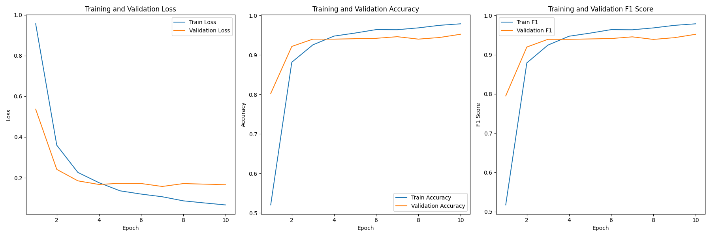

# 中文新闻文本情感三分类模型 Chinese news text sentiment three classification model

[README_en](README_en.md)

# 1.简介
本模型是基于huggingface上'hfl/chinese-roberta-wwm-ext'模型基础上微调的中文新闻文本情感的三分类（负面，中性，正面）模型。
之前有一个版本的微调模型'yangjiurong/chinese-sentiment-c3-v1'效果一般，后经过调整发布这个模型的V2版本，准确率和泛化有极大提升。
模型训练的初衷是想找一个可用的中文文本情感三分类模型，查看了一些模型后发现，目前在情感分类领域，英语文本分类模型的细分领域中有二分类的，三分类，五分类等一系列文本情感分类模型，类型比较多样完整，但是中文文本分类细分领域大多是二分类模型，只有极少数的五分类、七分类模型，三分类模型较少，因此决定训练并发布一个三分类的中文文本情感分类模型。
模型是初次训练和发布提交，难免会有不妥之处，还请大家不吝指正为谢！

github 上传大文件失败，模型文件请移步[魔塔社区仓库](https://modelscope.cn/models/yangjiurong/chinese-news-title-sentiment-c3-v2/summary)

# 2.模型性能
|Train loss | Train Accuracy | Train F1 | Eval loss | Eval Accuracy | Eval F1 |
|--|--|--|--|
|0.0665	| 0.9791 |	0.9788 |	0.1657 | 0.9527 | 0.9520 |



# 3.Model loading
> Please use the following loading method to load the model
```python
from transformers import BertTokenizer, BertForSequenceClassification
import torch

model_id = 'yangjiurong/chinese-news-title-sentiment-c3-v2'

tokenizer = BertTokenizer.from_pretrained(model_id)
model = BertForSequenceClassification.from_pretrained(model_id)
```
> Please use the following method to use the model
```python
news = [
    "沪指跌0.3%，再度跌破3200点。",
    "科创50涨幅扩大至1%，科技龙头集体反弹，九号公司领涨近4%，石头科技、寒武纪、海光信息涨幅居前。",
    "OLED板块爆发，彩虹股份强势封板，维信诺、京东方A涨超6%，TCL科技、东山精密、深天马A放量拉升。",
    "高盛：2025年金价涨势放缓，2026年中期才会达到3000美元。",
    "A股午后拉升，沪指、深成指拉升翻红，创业板指跌幅收窄至0.5%。",
    "三桶油短线走低，中国石油跌超1.5%，中国石化、中国海油跌近1%。",
    "这家酒店不太行，环境太差了！",
    "我女朋友说这家餐厅的味道不错，下次我们还要来！",
    "我觉得这个对于我来说一般般吧，可以推荐给有需要的朋友",
    "这个东西对我来说很差劲，不过可以分享给别人试试",
]

id2_label = {0: "负面" , 1: "中性" , 2: "正面" }

model.eval()
with torch.inference_mode():
    for item in news:
        inputs = train_tokenizer(item, return_tensors="pt")
        inputs = {k: v.cuda() for k,v in inputs.items()}
        logits = train_model(**inputs).logits
        pred = torch.argmax(logits, dim=-1)
        print(f"输入： {item} ,  模型预测结果： {id2_label.get(pred.item())}")   
```

# 4.训练方法
采用transformers库完成训练，使用了其中的Trainer 和 TrainingArguments 。

## 4.1 数据预处理
首先，将上面提到的数据集通过datasets加载为dataset，并将其中的原始标签转换为数字{ "negative": 0 , "neutral": 1 , "positive": 2 }。
其次，加载模型分词器，将数据处理成transformer所需的格式。

## 4.2 定义训练参数

> 注意下面参数中的微调超参部分需要自己定义一个参数对象或修改为具体的参数值
> ，最好不要启用fp16，在训练过程中发现启用fp16后会导致梯度不能正常控制，会爆炸！

```python
train_args = TrainingArguments(
    output_dir=f"./results",      # 输出文件夹
    logging_steps=10,                  # log 打印的频率
    eval_strategy="epoch",             # 评估策略
    save_strategy="epoch",             # 保存策略
    save_total_limit=2,                # 最大保存数
    metric_for_best_model="f1",        # 设定评估指标
    dataloader_num_workers=8,          # 增加数据加载器的工作线程数
    load_best_model_at_end=True,       # 训练完成后加载最优模型
    log_level="info",                  # 设置日志级别为info，显示更多细节
    report_to="tensorboard",           # 使用TensorBoard进行可视化
    # 微调超参
    num_train_epochs=param_dist['num_train_epochs'],  # 训练的epoch数量（可以设置更高，结合早停法使用）
    per_device_train_batch_size=param_dist['per_device_train_batch_size'],   # 训练时的batch_size
    per_device_eval_batch_size=param_dist['per_device_eval_batch_size'],     # 验证时的batch_size
    learning_rate=param_dist['learning_rate'],            # 初始学习率
    lr_scheduler_type=param_dist['lr_scheduler_type'],    # 使用余弦退火学习率调度器    
    warmup_ratio=param_dist['warmup_ratio'],              # 设置预热比例，避免学习率过快下降
    weight_decay=param_dist['weight_decay'],                # L2正则化系数
)
```

## 4.3 创建评估函数
```python
def compute_metrics(eval_pred):
    logits, labels = eval_pred
    predictions = np.argmax(logits, axis=-1)
    acc = accuracy_score(labels, predictions)
    f1 = f1_score(labels, predictions, average='weighted')
    return {"accuracy": acc, "f1": f1}
```

## 4.4 创建训练器
```python
trainer = Trainer(
    model=train_model,                                                 # 模型实例
    args=train_args,                                                   # 上面定义的训练参数
    train_dataset=tokenized_datasets['train'],                         # 训练数据集
    eval_dataset=tokenized_datasets['valid'],                          # 验证数据集
    compute_metrics=compute_metrics,                                       # 评估函数
    data_collator=DataCollatorWithPadding(tokenizer=train_tokenizer),  # 批量加载器
)
```

## 4.5 训练模型
```python
trainer.train()
```

## 4.6 评估模型
```python
trainer.evaluate()
```


# 5.使用方式
使用transformers的pipeline加载
```python
from transformers import pipeline

model_id = 'yangjiurong/chinese-sentiment-c3-v1'

pipe = pipeline(
    "text-classification",
    model=model_id,
    tokenizer=model_id
)

texts = [
    '我是测试文本',
    '我觉得还差点意思',
]
pipe(texts)
```
