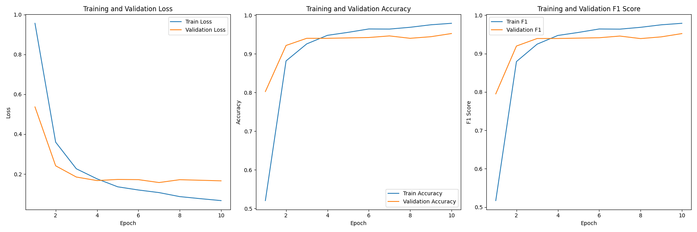

# Chinese news text sentiment three classification model

# 1. Introduction
This model is a three class (negative, neutral, positive) emotional classification model for Chinese news text, which is fine tuned based on the 'hfl/Chinese Robert wwm ext' model on Huggingface.
Previously, there was a version of the fine-tuning model 'yangjiurong/Chinese statiment-c3-v1' that had mediocre performance. After adjustments, the V2 version of this model was released, which greatly improved its accuracy and generalization.
The original intention of model training was to find a usable Chinese text emotion three classification model. After reviewing some models, it was found that currently in the field of emotion classification, there are a series of text emotion classification models such as binary classification, ternary classification, and quintuple classification in the subdivision field of English text classification models. The types are relatively diverse and complete, but most of the subdivision fields of Chinese text classification are binary classification models, with only a very small number of quintuple classification and septuple classification models. Therefore, it was decided to train and release a three classification Chinese text emotion classification model.
The model is being trained and released for the first time, so there may be some inappropriate aspects. Please kindly correct them. Thank you!


Failed to upload large file on GitHub, please move the model file to [modelscope](https://modelscope.cn/models/yangjiurong/chinese-news-title-sentiment-c3-v2/summary)


# 2. Model performance
|Train loss | Train Accuracy | Train F1 | Eval loss | Eval Accuracy | Eval F1 |
|--|--|--|--|--|--|
|0.0665	| 0.9791 |	0.9788 |	0.1657 | 0.9527 | 0.9520 |



# 3. Model loading
> Please use the following loading method to load the model
```python
from transformers import BertTokenizer, BertForSequenceClassification
import torch

model_id = 'yangjiurong/chinese-news-title-sentiment-c3-v2'

tokenizer = BertTokenizer.from_pretrained(model_id)
model = BertForSequenceClassification.from_pretrained(model_id)
```
> Please use the following method to use the model
```python
news = [
    "沪指跌0.3%，再度跌破3200点。",
    "科创50涨幅扩大至1%，科技龙头集体反弹，九号公司领涨近4%，石头科技、寒武纪、海光信息涨幅居前。",
    "OLED板块爆发，彩虹股份强势封板，维信诺、京东方A涨超6%，TCL科技、东山精密、深天马A放量拉升。",
    "高盛：2025年金价涨势放缓，2026年中期才会达到3000美元。",
    "A股午后拉升，沪指、深成指拉升翻红，创业板指跌幅收窄至0.5%。",
    "三桶油短线走低，中国石油跌超1.5%，中国石化、中国海油跌近1%。",
    "这家酒店不太行，环境太差了！",
    "我女朋友说这家餐厅的味道不错，下次我们还要来！",
    "我觉得这个对于我来说一般般吧，可以推荐给有需要的朋友",
    "这个东西对我来说很差劲，不过可以分享给别人试试",
]

id2_label = {0: "负面" , 1: "中性" , 2: "正面" }

model.eval()
with torch.inference_mode():
    for item in news:
        inputs = train_tokenizer(item, return_tensors="pt")
        inputs = {k: v.cuda() for k,v in inputs.items()}
        logits = train_model(**inputs).logits
        pred = torch.argmax(logits, dim=-1)
        print(f"输入： {item} ,  模型预测结果： {id2_label.get(pred.item())}")   
```

# 4. Training methods
We used the transformers library for training, including Trainer and TrainingArguments.

## 4.1 Data Preprocessing
Firstly, load the dataset mentioned above into a dataset using datasets, and convert the original labels into numbers {"negative": 0, "neutral": 1, "positive": 2}.
Secondly, load the model tokenizer to process the data into the format required by the transformer.

## 4.2 Defining Training Parameters

> Please note that the fine-tuning hyperparameter section in the following parameters requires defining a parameter object or modifying it to a specific parameter value
> It is best not to enable FP16. During the training process, it was found that enabling FP16 would cause the gradient to not be controlled properly and could explode!

```python
train_args = TrainingArguments(
    output_dir=f"./results",      # 输出文件夹
    logging_steps=10,                  # log 打印的频率
    eval_strategy="epoch",             # 评估策略
    save_strategy="epoch",             # 保存策略
    save_total_limit=2,                # 最大保存数
    metric_for_best_model="f1",        # 设定评估指标
    dataloader_num_workers=8,          # 增加数据加载器的工作线程数
    load_best_model_at_end=True,       # 训练完成后加载最优模型
    log_level="info",                  # 设置日志级别为info，显示更多细节
    report_to="tensorboard",           # 使用TensorBoard进行可视化
    # 微调超参
    num_train_epochs=param_dist['num_train_epochs'],  # 训练的epoch数量（可以设置更高，结合早停法使用）
    per_device_train_batch_size=param_dist['per_device_train_batch_size'],   # 训练时的batch_size
    per_device_eval_batch_size=param_dist['per_device_eval_batch_size'],     # 验证时的batch_size
    learning_rate=param_dist['learning_rate'],            # 初始学习率
    lr_scheduler_type=param_dist['lr_scheduler_type'],    # 使用余弦退火学习率调度器    
    warmup_ratio=param_dist['warmup_ratio'],              # 设置预热比例，避免学习率过快下降
    weight_decay=param_dist['weight_decay'],                # L2正则化系数
)
```

## 4.3 Creating Evaluation Functions
```python
def compute_metrics(eval_pred):
    logits, labels = eval_pred
    predictions = np.argmax(logits, axis=-1)
    acc = accuracy_score(labels, predictions)
    f1 = f1_score(labels, predictions, average='weighted')
    return {"accuracy": acc, "f1": f1}
```

## 4.4 Creating a Trainer
```python
trainer = Trainer(
    model=train_model,                                                 # 模型实例
    args=train_args,                                                   # 上面定义的训练参数
    train_dataset=tokenized_datasets['train'],                         # 训练数据集
    eval_dataset=tokenized_datasets['valid'],                          # 验证数据集
    compute_metrics=compute_metrics,                                       # 评估函数
    data_collator=DataCollatorWithPadding(tokenizer=train_tokenizer),  # 批量加载器
)
```

## 4.5 Training Model
```python
trainer.train()
```

## 4.6 Evaluation Model
```python
trainer.evaluate()
```


# 5.Usage
Load using transformers' pipeline
```python
from transformers import pipeline

model_id = 'yangjiurong/chinese-sentiment-c3-v1'

pipe = pipeline(
    "text-classification",
    model=model_id,
    tokenizer=model_id
)

texts = [
    '我是测试文本',
    '我觉得还差点意思',
]
pipe(texts)
```


